# Forum App – React, Next.js & TypeScript

A responsive frontend for a full-stack Q&A forum application, built with React, TypeScript, and Next.js. It enables users to register, log in, browse and post questions, submit answers, and interact through likes and dislikes — all within a modular, user-friendly interface that follows clean UI/UX principles.

## Project Overview

This React and Next.js frontend serves as the client-side interface for a full-stack Q&A forum. It communicates with a secured RESTful API to support user registration, authentication, question posting, answer submission, and interactive features such as likes and dislikes.

The application uses client-side routing, modular components, and scoped CSS Modules for maintainable styling. Authentication is managed via JWTs stored in cookies, with protected routes and conditional rendering based on login state. The layout is fully responsive and optimized for usability across both desktop and mobile devices.

## Key Features

### Authentication & Session Management

- Secure login and registration with custom client-side validation
- JWT tokens stored in cookies using js-cookie for persistent sessions
- Session is validated on page load; protected routes redirect unauthenticated users
- Log out functionality with confirmation modal and automatic redirect
- UI elements such as delete buttons conditionally render based on authentication state

### Question Management

- Authenticated users can submit new questions via controlled forms
- All users can browse a list of questions with titles, previews, authors, and timestamps
- Questions can be filtered by status: All / Answered / Unanswered
- Users can delete their own questions with confirmation modals
- Question cards use dynamic routing (/question/[id]) and pass data via query
- Questions automatically update their isAnswered status based on the presence or removal of answers

### Answer Management

- All users (including unauthenticated) can view answers under a question
- Authenticated users can post answers with form validation
- Answers are displayed with the author's name, timestamp, and net like count
- Answers are sorted by popularity (like count)
- Users can delete their own answers with confirmation modals
- Submissions provide real-time feedback through confirmation or error messages

### Likes & Dislikes

- Authenticated users can like or dislike answers
- Reactions are mutually exclusive and reversible
- Interaction updates the like/dislike count in real time
- Buttons visually reflect active state for user clarity

### UI/UX and Feedback

- Fully responsive design optimized for mobile, tablet, and desktop
- Loading indicators via custom spinners for API calls and form submissions
- Validation errors and success messages shown in real-time
- Modals used for confirmation prompts (logout, deletions, etc.)
- Subtle animated element on the landing page for visual engagement

### Validation & Error Handling

- Custom validators for all form types (sign-up, login, question, answer)
- Client-side validation prevents invalid data from being submitted
- API errors are caught and shown to users with clear, contextual messages

### Architecture & Best Practices

- Modular, reusable components (e.g., Button, Modal, Spinner, PageTemplate)
- Domain-driven folder structure promoting separation of concerns
- Scoped styles using CSS Modules for maintainable and collision-free styling
- API communication abstracted in apiCalls/ by domain (user, question, answer)
- Client-side route protection using isProtected flag and Next.js router
- Shared layout components ensure consistent structure across views

## Technologies Used

- **React** – Frontend library for building user interfaces
- **Next.js** – Framework for routing and page rendering
- **TypeScript** – Static typing for improved code quality and safety
- **Axios** – HTTP client for communicating with the backend API
- **js-cookie** – Cookie handling for storing and retrieving JWT tokens
- **CSS Modules** – Scoped, modular component styling
- **ESLint** – Code linting and consistency enforcement

## Screenshots

### Landing Page (Animated)

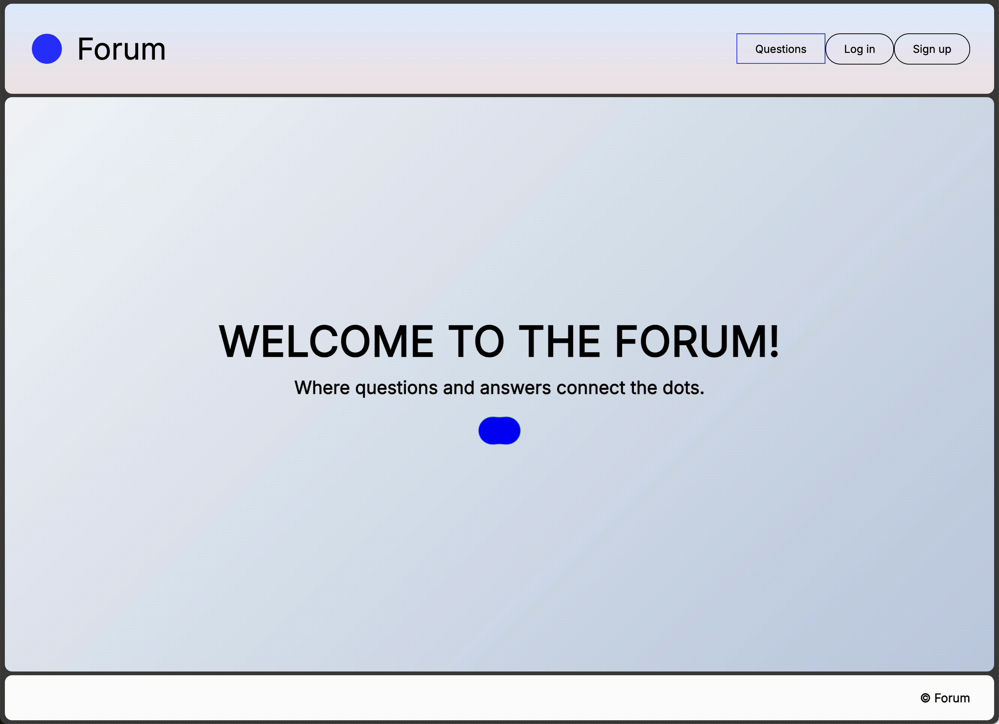

### All Questions – Desktop

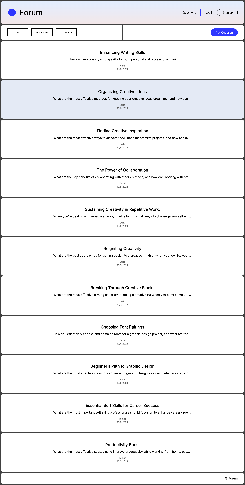

### Question with Answers – Logged In

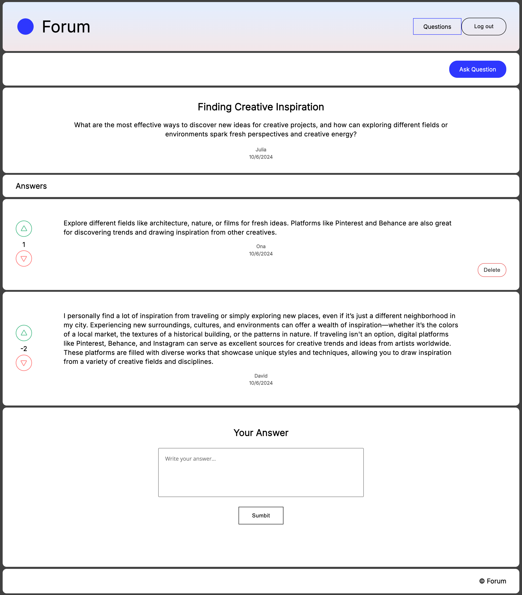

### Question with Answers – Guest Errors


### Question with Answers – Logged Out with Errors

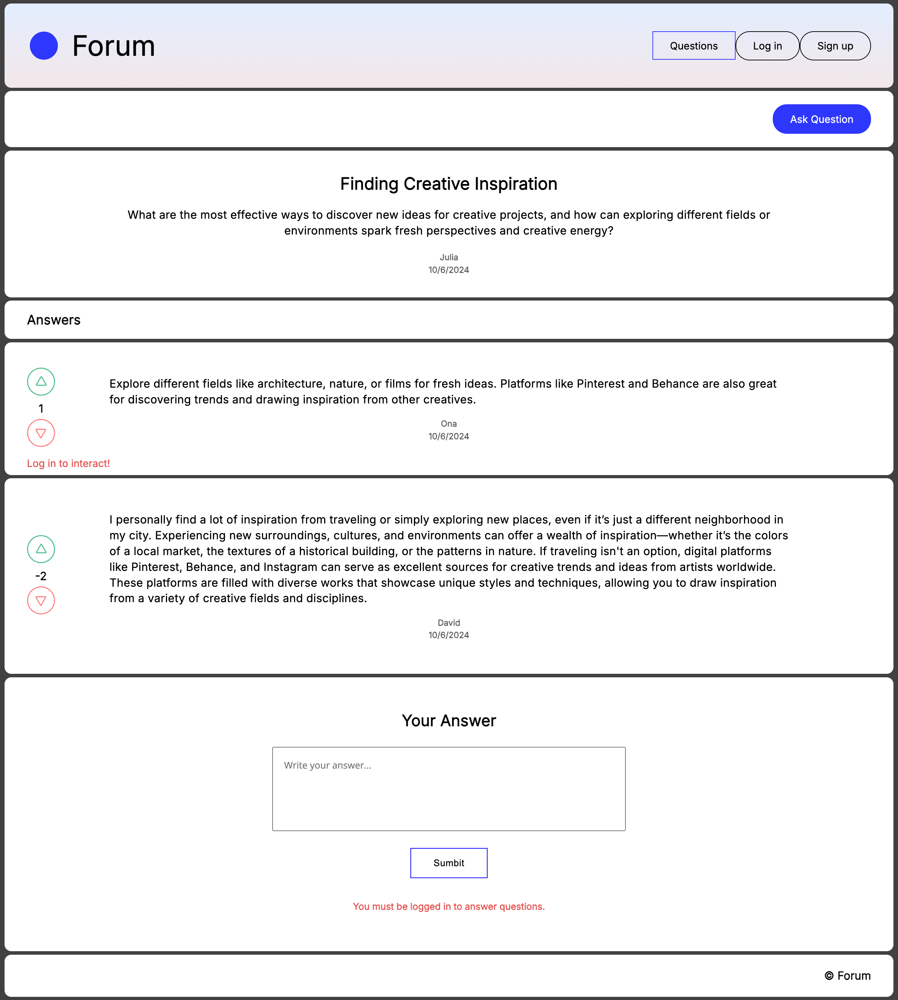

### Sign Up Form

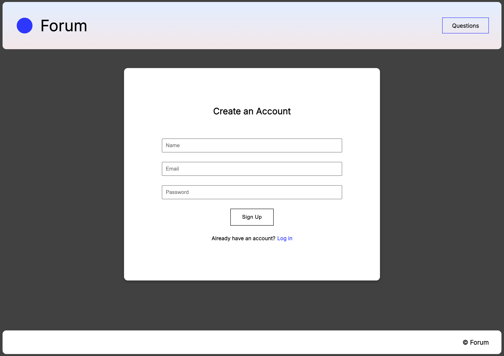

### Login Form

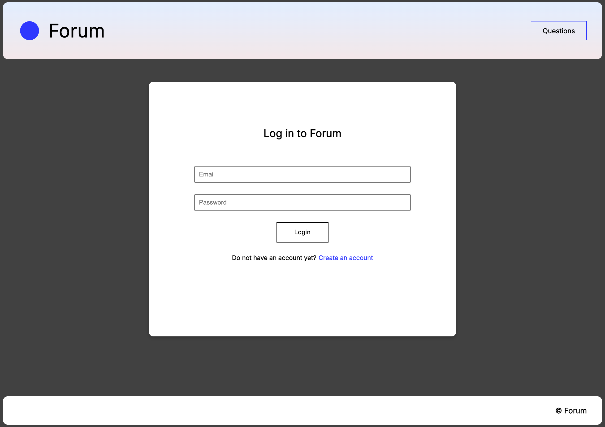

### Ask a Question Form

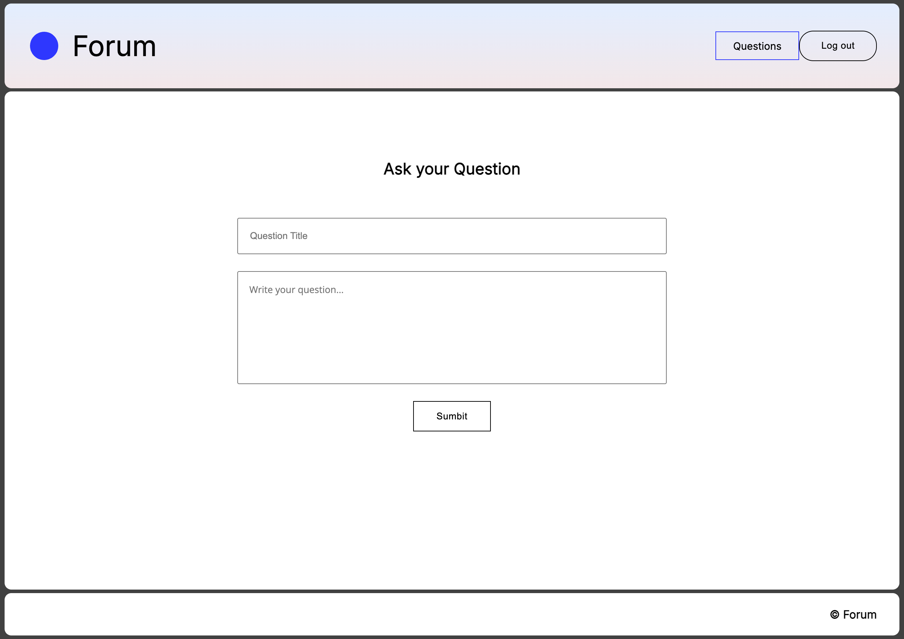

### Sign Up – Password Validation Error

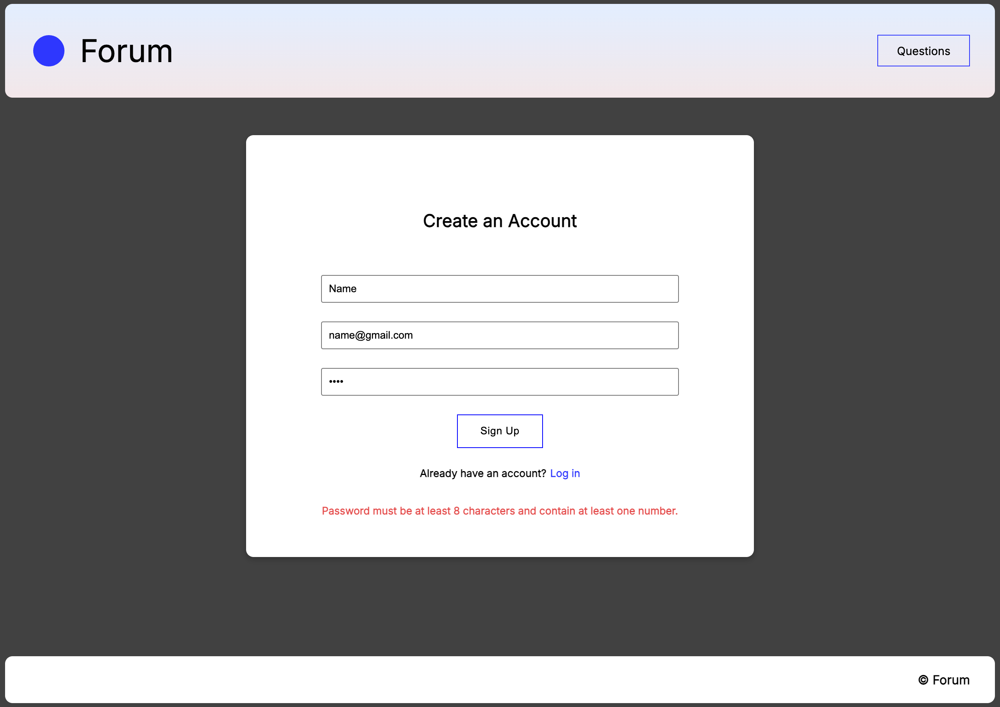

### Logout Confirmation Modal

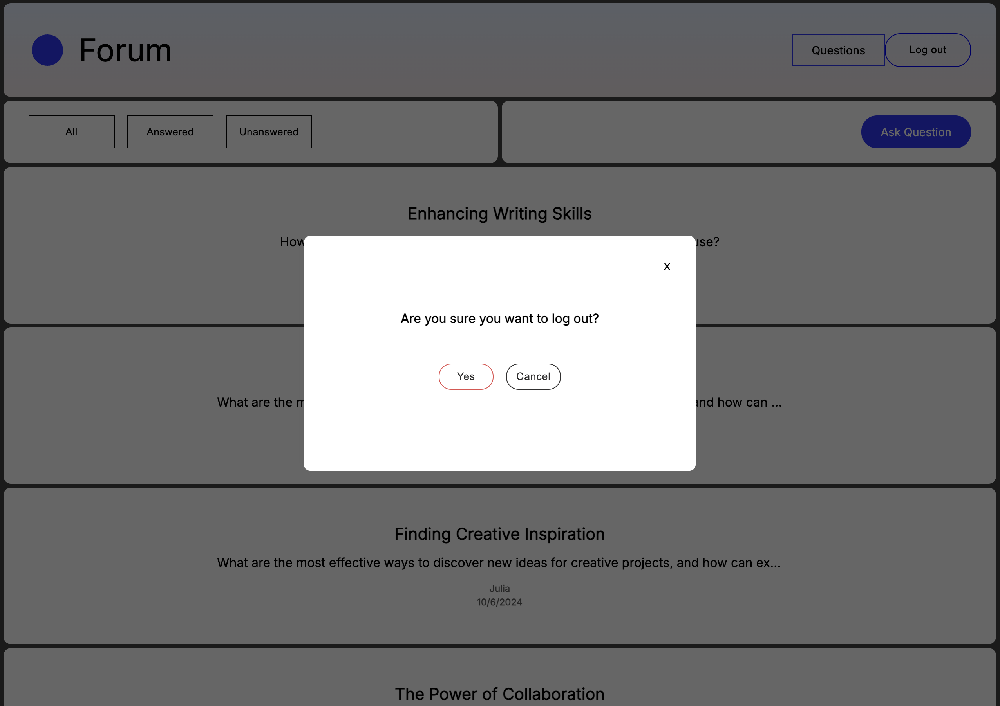

### Mobile Navigation

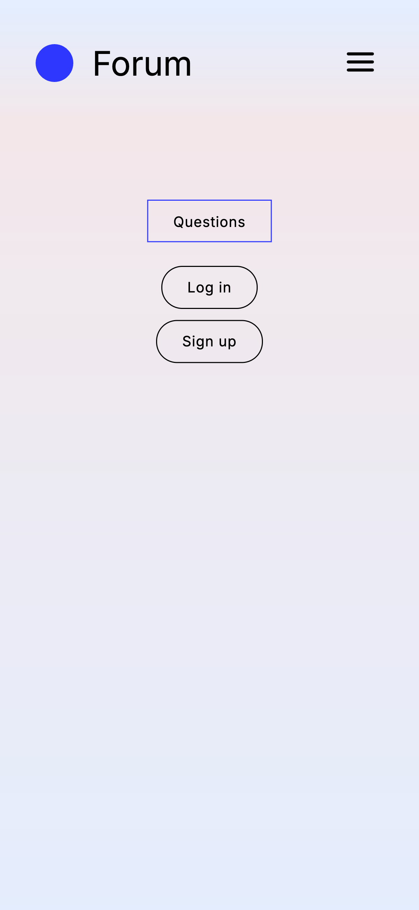

### All Questions – Mobile

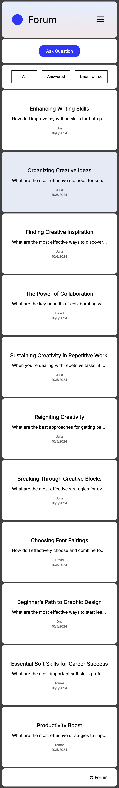

## Getting Started

### 1. Clone the Repository

```bash
git clone https://github.com/JustinaVilcinskaite/forum-app-react-next-ts.git
cd forum-app-react-next-ts
```

### 2. Install Dependencies

```bash
npm install
```

### 3. Run the Development Server

```bash
npm run dev
```

The app will be available at `http://localhost:3000`.

> **Note**: API URL and JWT key are configured in `next.config.mjs`.

### 4. Run the Backend

Make sure your backend server (`forum-api-node-express`) is running at `http://localhost:3002`.

> **Note:** This is the frontend for a full-stack Q&A forum application.  
> To fully use the application, the corresponding backend (built with Node.js and Express) must also be running.  
> Refer to the [`forum-api-node-express`](https://github.com/JustinaVilcinskaite/forum-api-node-express) repository for backend setup instructions.

## Project Structure

```
react-forum-app/
├── apiCalls/             # Axios methods grouped by domain (user, question, answer)
├── assets/               # Static SVG icons
│   └── screenshots/      # UI screenshots used in the README
├── components/           # UI components grouped by feature and view
│   ├── Answer/
│   ├── QuestionForm/
│   ├── Modal/
│   ├── PageTemplate/
│   └── ...
├── dataValidations/      # Custom validators for form inputs
├── pages/                # Next.js page routes (login, questions, etc.)
├── public/               # Public static files
├── styles/               # Global and module-scoped CSS
├── types/                # Shared TypeScript interfaces and types
├── utils/                # Utility functions (auth headers, formatters, etc.)
├── next.config.mjs       # Next.js config with environment variables
├── package.json
├── tsconfig.json
└── README.md
```
