# Forum App – React, Next.js & TypeScript

A responsive frontend for a full-stack Q&A forum application, built with React, TypeScript, and Next.js. It allows users to register, log in, browse and post questions, submit answers, and interact through likes and dislikes in a modular interface designed for desktop and mobile use.

## Project Overview

This frontend provides the client-side interface for a full-stack Q&A forum application. It communicates with a backend REST API to support user registration, authentication, question posting, answer submission, and answer reactions such as likes and dislikes.

The application uses Next.js page-based routing, reusable components, and CSS Modules for styling. Authentication is handled with JWT tokens stored in cookies, and protected pages validate the user token before allowing access. The layout is responsive and built to work across desktop and mobile devices.

## Key Features

### Authentication & Session Management

- Secure login and registration with client-side validation
- JWT tokens stored in cookies using js-cookie
- Protected pages validate the user token and redirect unauthenticated users to the login page
- Logout flow includes a confirmation modal and redirect to the login page
- UI elements such as delete buttons render conditionally based on login state

### Question Management

- Authenticated users can submit new questions through controlled forms
- All users can browse a list of questions with titles, previews, authors, and timestamps
- Questions can be filtered by status: All / Answered / Unanswered
- Users can delete their own questions with confirmation modals
- Question cards link to dynamic question detail pages

### Answer Management

- All users can view answers under a question
- Authenticated users can post answers with client-side validation
- Answers are displayed with the author's name, timestamp, and like score
- Answers are sorted by popularity
- Users can delete their own answers with confirmation modals
- Submissions provide feedback through confirmation or error messages

### Likes & Dislikes

- Authenticated users can like or dislike answers
- Reactions are mutually exclusive and reversible
- The interface updates reaction counts after each action
- Buttons reflect active state for clearer user feedback

### UI/UX and Feedback

- Responsive layout for mobile, tablet, and desktop
- Loading indicators for API calls and form submissions
- Validation errors and success messages shown in context
- Modals used for confirmation prompts such as logout and deletions
- Animated element on the landing page for visual engagement

### Validation & Error Handling

- Custom validators for sign-up, login, question, and answer forms
- Client-side validation helps prevent invalid submissions
- API errors are caught and shown with user-facing messages

### Architecture & Best Practices

- Reusable components such as Button, Modal, Spinner, and PageTemplate
- Feature-based API request helpers in `apiCalls/`
- Scoped styling with CSS Modules
- Protected page handling through `PageTemplate`
- Shared layout components for a consistent structure across pages

## Technologies Used

- **Frontend:** React, Next.js, TypeScript
- **API Communication:** Axios
- **Authentication:** js-cookie
- **Styling:** CSS Modules
- **Tooling:** ESLint

## Screenshots

### Landing Page (Animated)

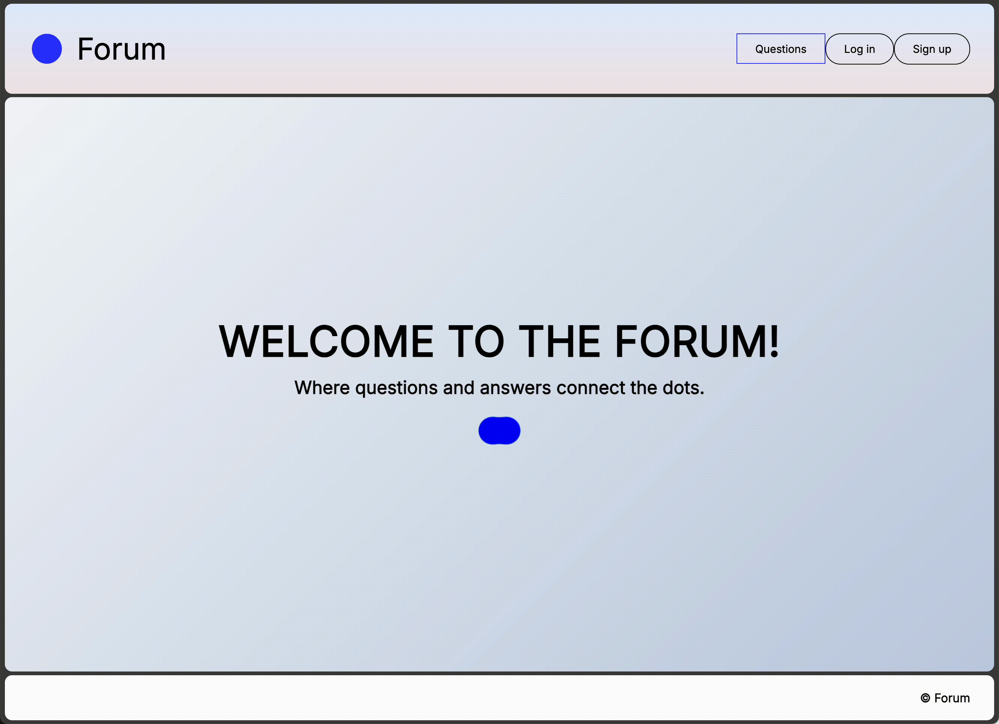

### All Questions – Desktop

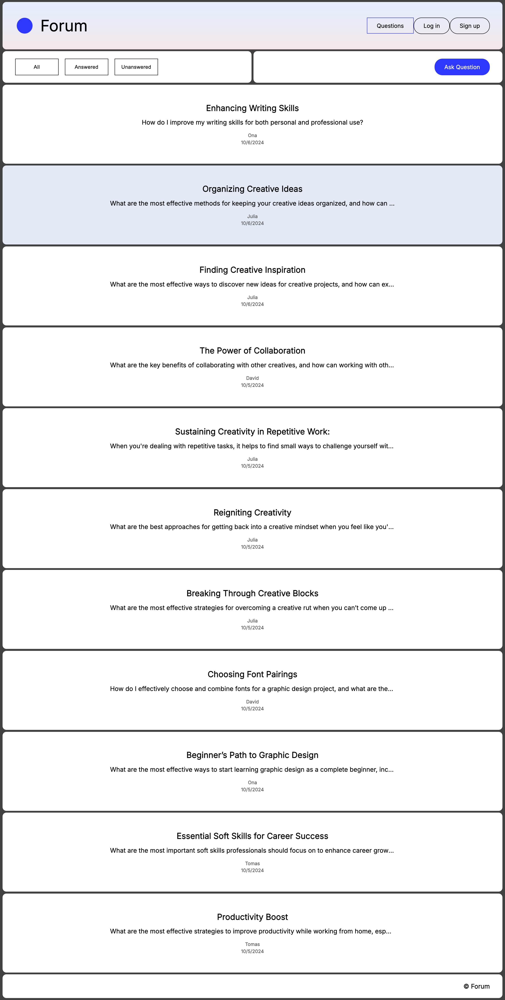

### Question with Answers – Logged In

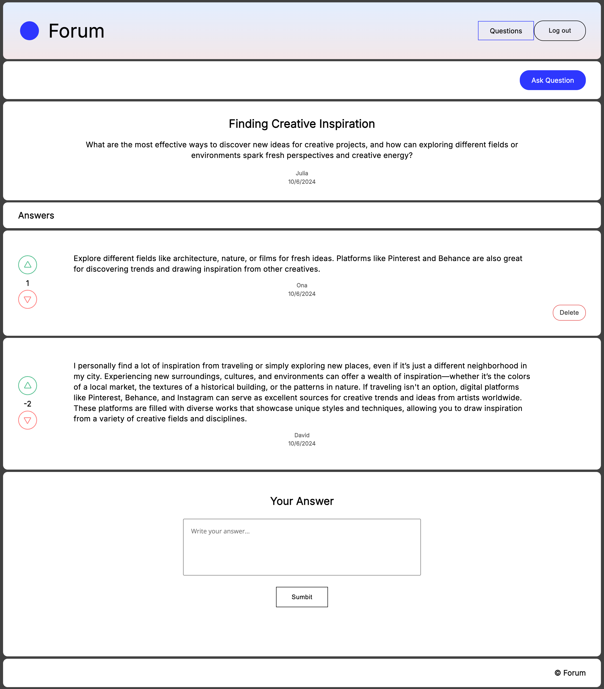

### Question with Answers – Logged Out with Errors

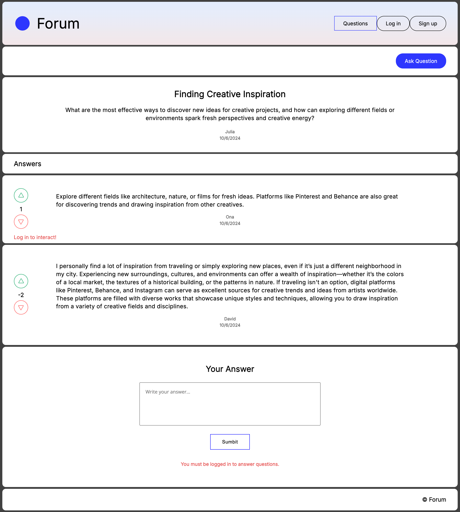

### Sign Up Form

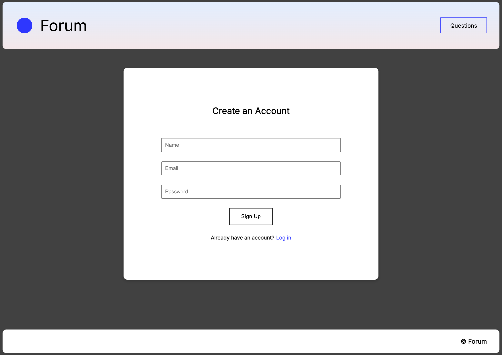

### Login Form

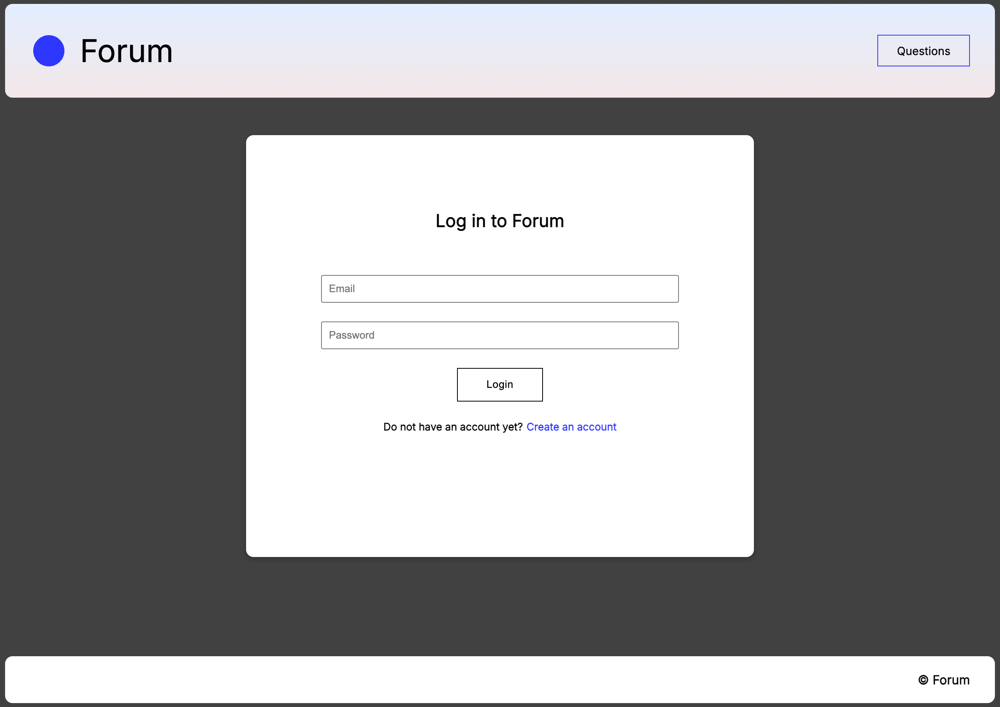

### Ask a Question Form

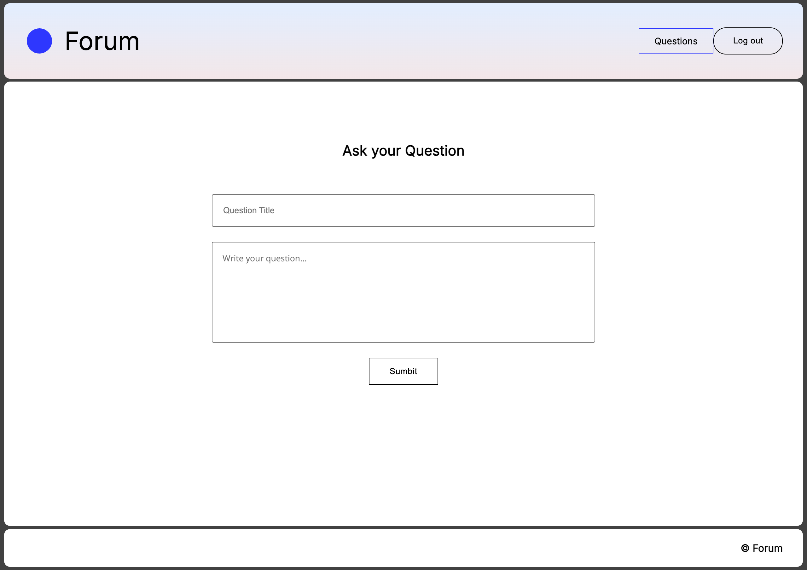

### Sign Up – Password Validation Error

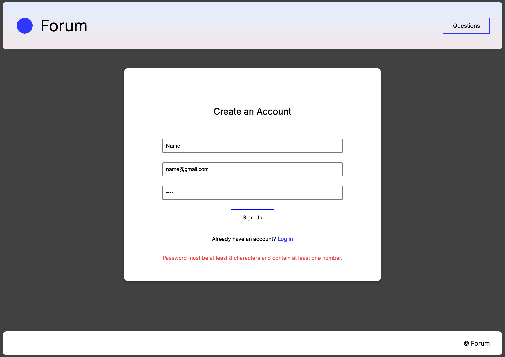

### Logout Confirmation Modal

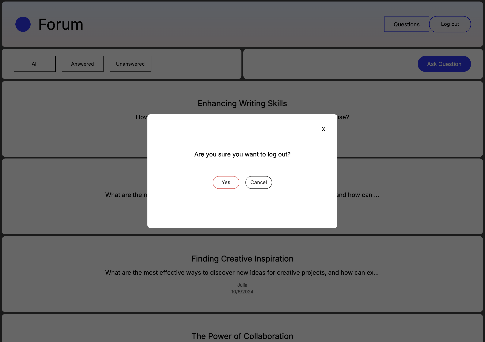

### Mobile Navigation

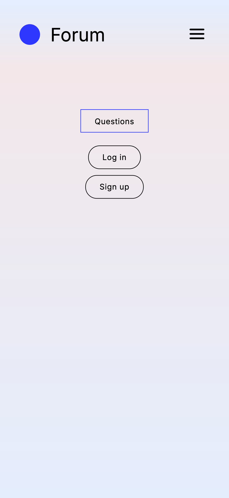

### All Questions – Mobile

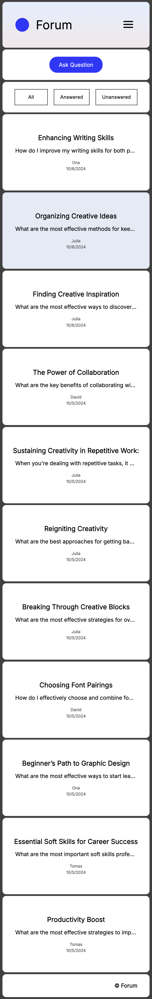

## Getting Started

### 1. Clone the Repository

```bash
git clone https://github.com/JustinaVilcinskaite/forum-app-react-next-ts.git
cd forum-app-react-next-ts
```

### 2. Install Dependencies

```bash
npm install
```

### 3. Run the Development Server

```bash
npm run dev
```

The app will be available at `http://localhost:3000`.

> **Note**: The API base URL and token cookie name are configured in `next.config.mjs`.  
> If you run the frontend with a local backend, update the API base URL accordingly.

### 4. Run the Backend

Make sure your backend server (`forum-api-node-express`) is running and that the frontend API base URL points to the correct backend environment.

> **Note:** This is the frontend for a full-stack Q&A forum application.  
> To fully use the application, the corresponding backend (built with Node.js and Express) must also be running.  
> Refer to the [`forum-api-node-express`](https://github.com/JustinaVilcinskaite/forum-api-node-express) repository for backend setup instructions.

## Project Structure

```
forum-app-react-next-ts/
├── docs/
│   └── screenshots/       # README screenshots
├── apiCalls/              # API request helpers
├── assets/                # Static icons and images
├── components/            # Reusable UI components
├── dataValidations/       # Form validators
├── pages/                 # Next.js pages and routes
│   ├── login/
│   ├── post-question/
│   ├── question/
│   ├── questions/
│   └── signup/
├── public/                # Public static assets
├── styles/                # Global and modular styles
├── types/                 # Shared TypeScript types
├── utils/                 # Helper functions
├── next.config.mjs
├── next-env.d.ts
├── package.json
├── tsconfig.json
└── README.md
```
