# Forum App – Frontend

Responsive frontend for a full-stack Q&A forum application built with React, Next.js, and TypeScript.

This project provides the client-side interface for a forum where users can register, log in, browse and filter questions, post questions, submit answers, and interact with answers through likes and dislikes. It connects to a separate Node.js/Express REST API and uses JWT tokens stored in cookies for authenticated user actions.

## Tech Stack

- React
- Next.js
- TypeScript
- Axios
- js-cookie
- CSS Modules
- ESLint

## Features

### Authentication

- User registration and login with client-side validation
- JWT tokens stored in cookies using `js-cookie`
- Protected pages validate the user token and redirect unauthenticated users
- Logout flow with confirmation modal and redirect
- Conditional UI based on login state and content ownership

### Questions & Answers

- Browse questions with titles, previews, authors, and posting dates
- Filter questions by status: All / Answered / Unanswered
- View individual questions on dynamic detail pages
- Authenticated users can create questions and submit answers
- Users can delete their own questions and answers with confirmation modals
- Answers are displayed with author, posting date, and like score
- Answers are sorted by popularity

### Likes & Dislikes

- Authenticated users can like or dislike answers
- Likes and dislikes are mutually exclusive and reversible
- Reaction counts update after each action

### UI, Validation & Structure

- Responsive layout for mobile, tablet, and desktop
- User-facing validation, success, and error messages
- Reusable components such as `Button`, `Modal`, and `PageTemplate`
- Scoped styling with CSS Modules

## Screenshots

### Landing Page Animation

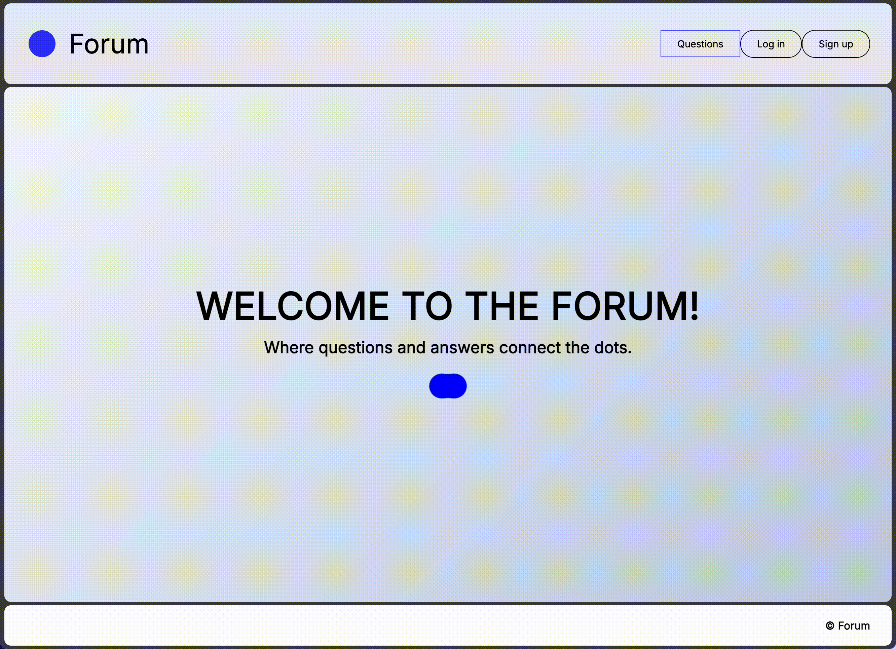

### All Questions – Desktop

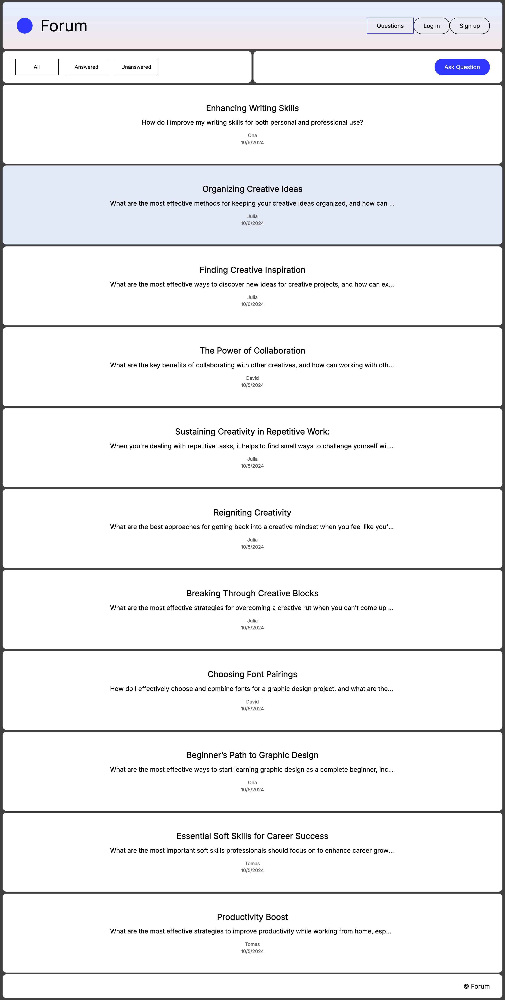

### Question with Answers – Logged In

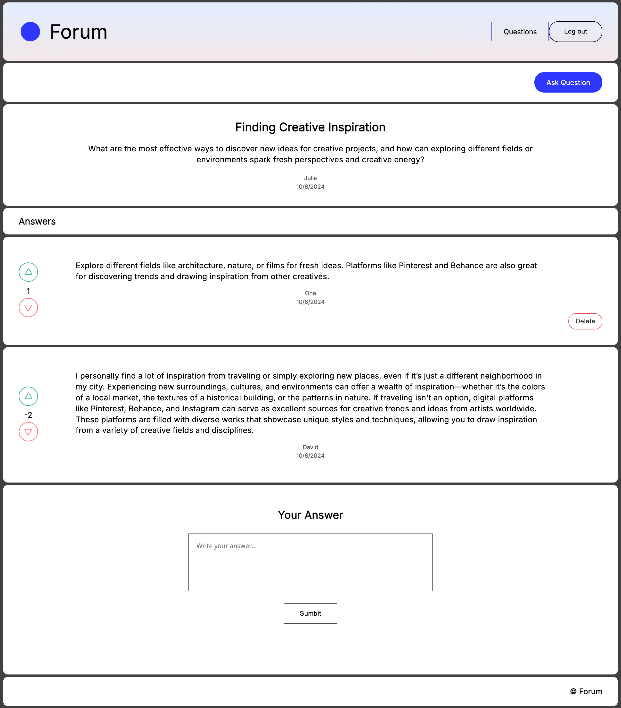

### Question with Answers – Logged Out with Errors

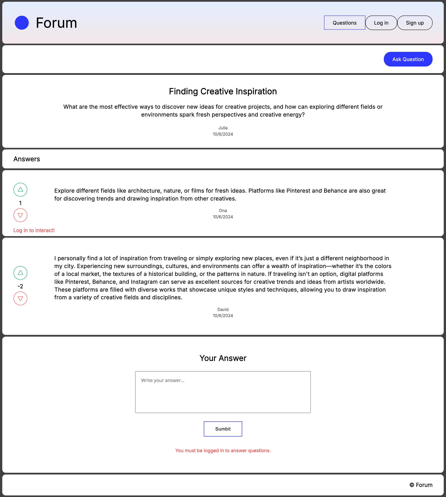

### Sign Up Form

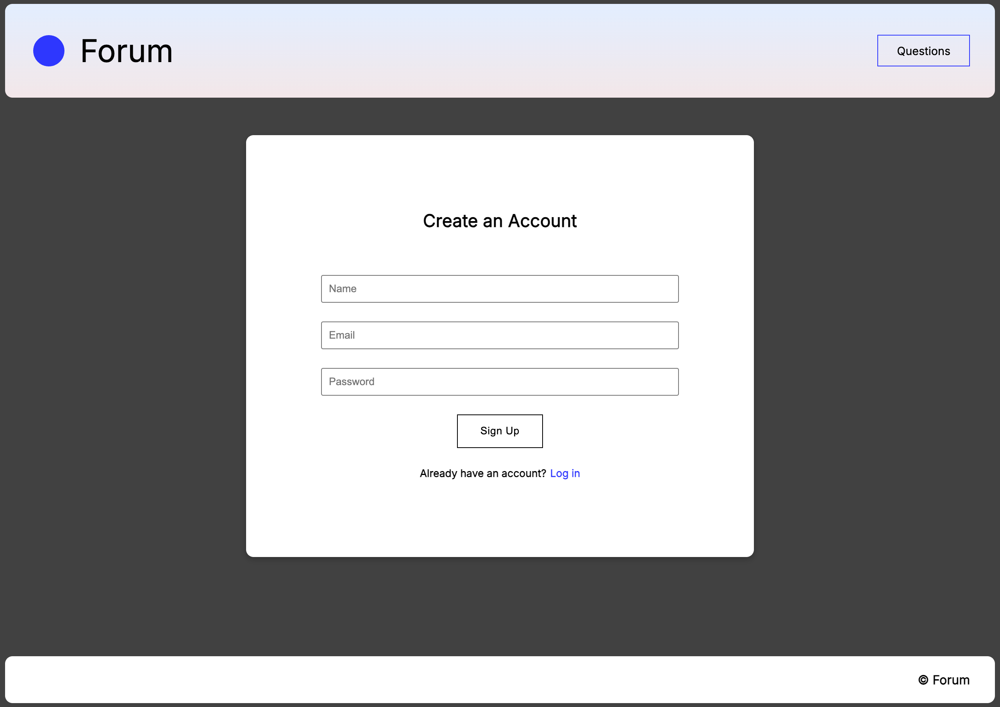

### Login Form

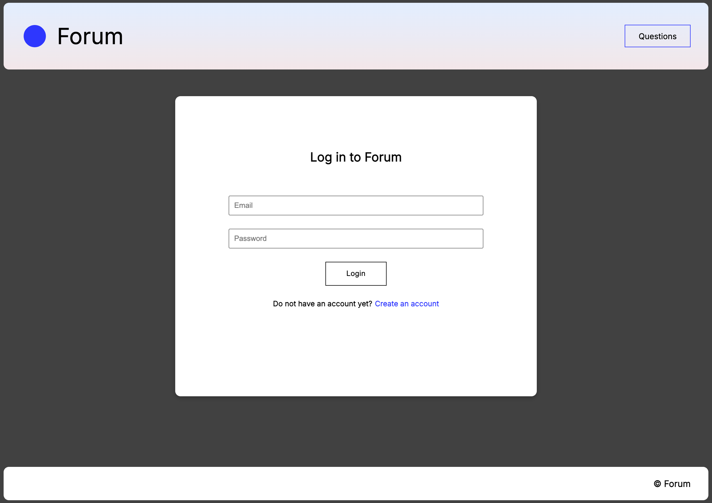

### Ask a Question Form

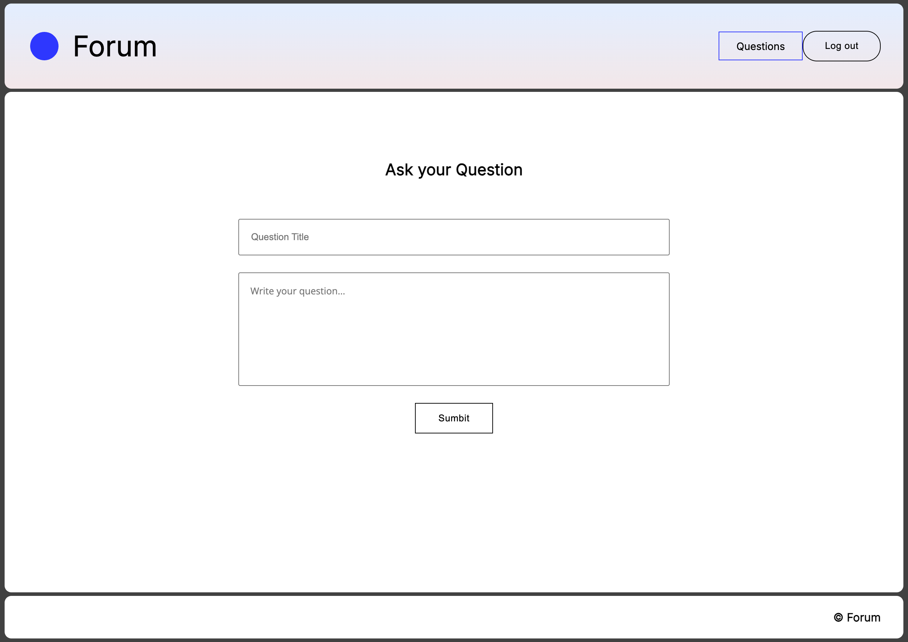

### Sign Up – Password Validation Error

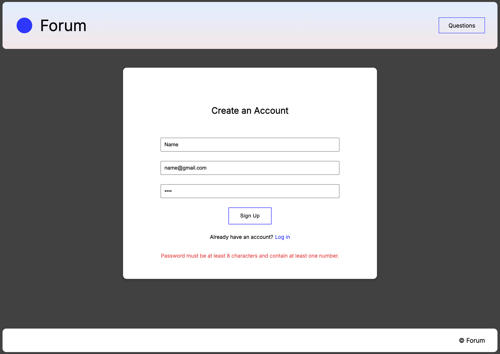

### Logout Confirmation Modal

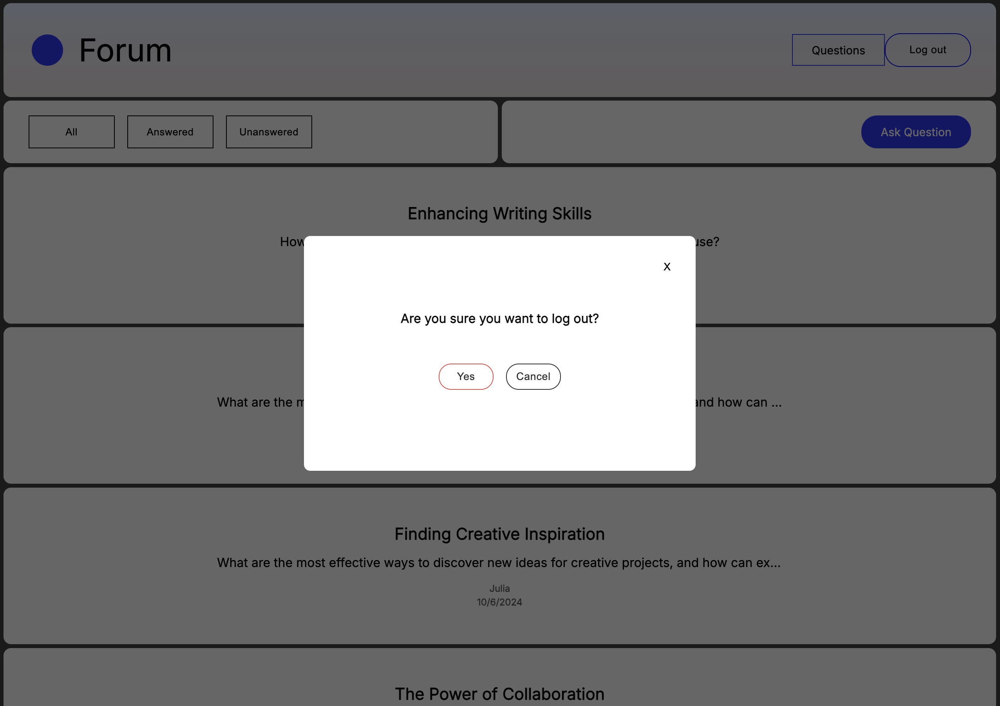

### Mobile Navigation

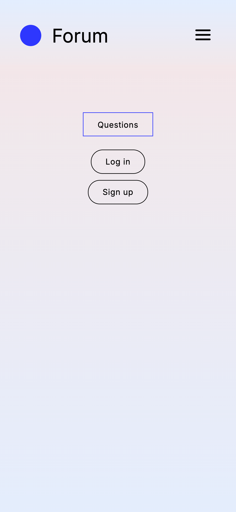

### All Questions – Mobile

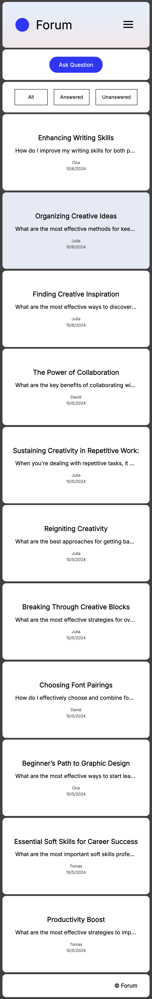

## Getting Started

### 1. Clone the repository

```bash
git clone https://github.com/JustinaVilcinskaite/forum-app-react-next-ts.git
cd forum-app-react-next-ts
```

### 2. Install dependencies

```bash
npm install
```

### 3. Run the development server

```bash
npm run dev
```

The app will be available at:

```bash
http://localhost:3000
```

### 4. Run the backend

This frontend connects to a separate Node.js/Express backend.  
To use the full application, run the backend locally as well:

[forum-api-node-express](https://github.com/JustinaVilcinskaite/forum-api-node-express)

## Project Structure

```text
forum-app-react-next-ts/
├── docs/
│   └── screenshots/       # README screenshots
├── apiCalls/              # API request helpers
├── assets/                # Icons and images
├── components/            # Reusable UI components
├── dataValidations/       # Form validation helpers
├── pages/                 # Next.js pages and routes
│   ├── login/
│   ├── post-question/
│   ├── question/
│   ├── questions/
│   └── signup/
├── public/                # Public static assets
├── styles/                # Global and modular styles
├── types/                 # TypeScript types
├── utils/                 # Helper functions
├── next.config.mjs
├── next-env.d.ts
├── package.json
├── tsconfig.json
└── README.md
```
